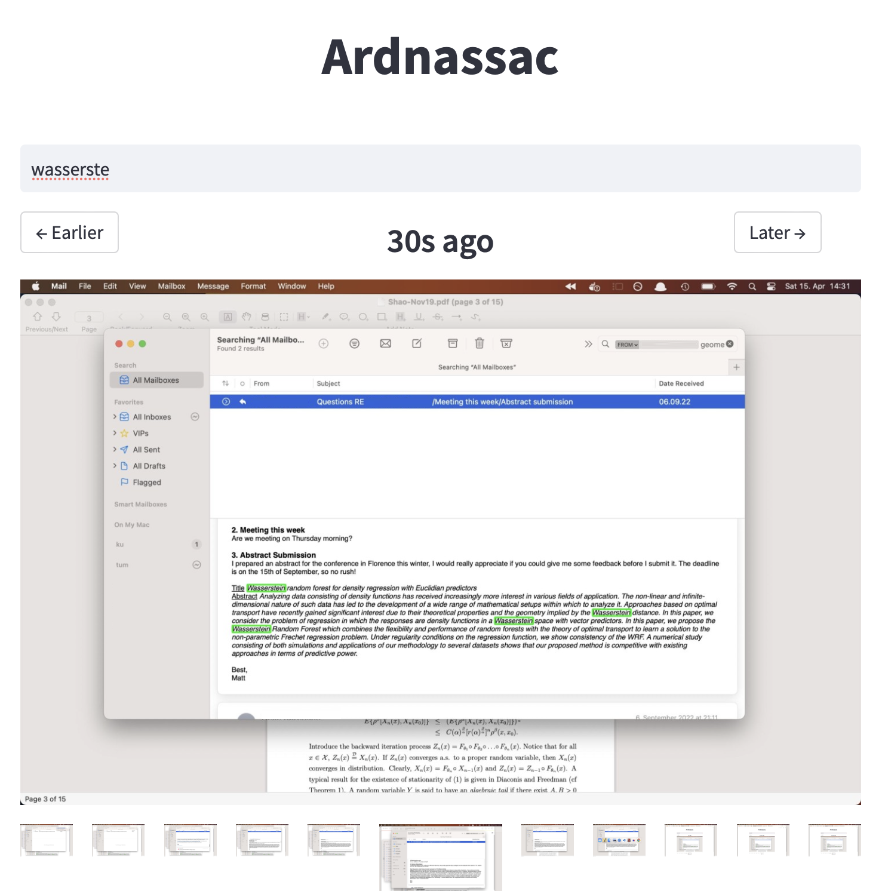

# Ardnassac

Ardnassac let's you search your past. It's a proof of concept, trying to reproduce the amazing product developed at [rewind.ai](rewind.ai) with open source tools.

It uses the python [PIL](https://pillow.readthedocs.io/en/stable/) library to take a screenshot of your entire screen every 3 seconds, and extracts text using the [tesseract](https://tesseract-ocr.github.io/) OCR software. The results are then stored in a `sqlite3` database, ready for querying.

The frontend is a simple [Streamlit](https://streamlit.io/) app with a text input, displaying matching screenshots with matches within the screen highlighted.

This approach wouldn't work for a real product because of the computation required to run the OCR every 3s. It runs smoothly on my macbook air, but I don't want 4 threads to be busy constantly running OCR jobs on my CPU. I assume that Rewind found a good way to speed this up. Also, their UX and integration with the OS is amazing and would be a lot of effort to reproduce.

Oh, and yes, the code is terrible, that's the point of a PoC 🙃.

## Screenshots

